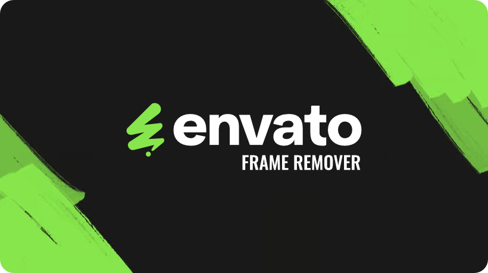

<p align="center">
  
</p>

# NoFrameVato

A Chrome extension that seamlessly removes preview iframes from Envato marketplaces (ThemeForest, CodeCanyon) and redirects you directly to the actual preview content. It features a modern, unobtrusive floating control panel injected directly into the page.

## Features

- **Auto-Remove Mode**: Automatically removes preview frames on visit (enabled by default).
- **Floating Control Panel**: A sleek, non-intrusive side panel to manage settings on the fly.
- **Premium UI**: "Glassmorphism" design with smooth, switch-like animations.
- **Context Preservation (Widget Mode)**: Optionally injects an elegant floating button panel on the creator's real external website, retaining Envato's "Buy Now" and "Details" links even after the redirect.
- **Smart Detection**: Specifically extracts product metadata from Envato domains and targets the `.full-screen-preview__frame` container safely.
- **Shadow DOM Isolation**: The UI and floating widgets are strictly encapsulated in Shadow DOM to avoid CSS bleeding onto any theme's complex stylesheets.

## Installation

### From Source

1. Clone this repository:
   ```bash
   git clone https://github.com/mvuljevas/noframevato.git
   ```
2. Open Chrome and navigate to `chrome://extensions/`.
3. Enable **Developer mode** (toggle in top-right corner).
4. Click **Load unpacked** and select the `noframevato` folder.

## Usage

- **Auto-Remove**: Just browse Envato network sites (ThemeForest, CodeCanyon, VideoHive, etc.). Preview iframe wrappers will vanish automatically, directly redirecting you to clean theme websites.
- **Floating Control Panel**: Click the extension icon to toggle the floating panel on any Envato page. From there, you can:
    - Perform a manual Envato frame removal.
    - Toggle the "Auto Remove" configuration.
    - Enable the **"Widget Mode (Test)"** configuration to keep the essential Envato purchase links natively floating on the target theme demo.

## Technical Details

- **Manifest V3**: Compliant with the latest Chrome Extension standards, utilizing `chrome.storage.local` context passing mechanisms and full domain permissions `<all_urls>` for cross-origin widget injection.
- **Architecture**:
    - `content.js`: Captures Envato metadata on previews, fires secure redirects, and injects floating Shadow DOM widgets seamlessly into third-party target showcase websites.
    - `content.css`: Base layout requirements for the floating panel.
    - `sidepanel.html/css/js`: An aesthetic UI implementation loaded inside an isolated inner iframe.
    - `background.js`: Event handler orchestration (relaying extension clicks).

## Development

### File Structure

```
noframevato/
├── manifest.json       # Extension configuration
├── background.js       # Service worker
├── content.js          # Injection logic
├── content.css         # Container styles
├── sidepanel.html      # Panel Structure
├── sidepanel.css       # Panel Styles
├── sidepanel.js        # Panel Logic
├── icons/              # Assets
└── README.md           # This file
```

## Credits

Crafted with love in 🇺🇾 by [Mauricio Vuljevas](https://www.mvuljevas.com?utm_source=noframevato).

## License

MIT License.
